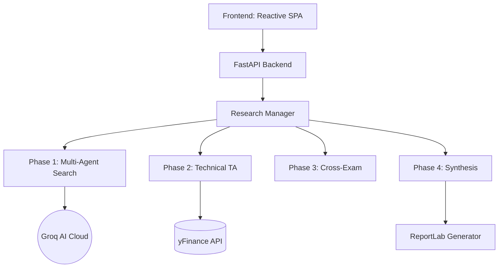

# 🪐 AlphaSwarm

> **Institutional-Grade AI Investment Research Engine**

AlphaSwarm is a high-performance, multi-agent research platform designed to provide deep, structured investment analysis. By orchestration of specialized AI agents, technical market data, and cross-examination protocols, AlphaSwarm delivers comprehensive research memos with institutional rigor.


---

## ⚡ Core Engine Features

### 1. Multi-Agent Research Pipeline (Phase 1)
AlphaSwarm deploys up to **18 specialized agents** simultaneously, each focusing on a distinct facet of a company:
- **Financial Specialists**: Fundamental analysis, balance sheet health, and valuation.
- **Sentiment Analysts**: Real-time news sentiment and social buzz (Twitter/X, Reddit).
- **Specialized Risks**: Regulatory, supply chain, management quality, and ESG.
- **Strategic Specialists**: Competitive landscape, growth catalysts, and "Bear/Bull" specialists.

### 2. High-Fidelity Technical Analysis (Phase 2)
Direct integration with market data via `yfinance` to compute real-time indicators:
- **Trend**: SMA (20, 50, 200), Golden/Death Cross detection.
- **Momentum**: RSI, MACD, Stochastic.
- **Volatility**: Bollinger Bands, ATR.
- **Patterns**: Automatic candlestick pattern recognition (Doji, Hammer, Engulfing).

### 3. Agent Cross-Examination (Phase 3)
A unique adversarial protocol where agents review each other's findings. This identifies inconsistencies, challenges assumptions, and reduces hallucination risk.

### 4. Institutional Synthesis (Phase 4)
The **Synthesis Judge** aggregates all findings, cross-exam notes, and technical data into a final structured memo.
- **Universal Scoring**: A weighted 1-10 technical/fundamental score.
- **Dynamic Verdicts**: BULLISH, BEARISH, or NEUTRAL with specific investment actions (BUY/HOLD/SELL).
- **PDF Export**: Generate polished, print-ready research memos via `ReportLab`.

---

## 🏗️ Architecture



---

## 🚀 Getting Started

### Prerequisites
- Python 3.9+
- [Groq API Key](https://console.groq.com/)

### Installation

1. **Clone the repository**
   ```bash
   git clone https://github.com/aaravg772/AlphaSwarm
   cd AlphaSwarm
   ```

2. **Set up Environment Variables**
   Create a `.env` file in the root directory:
   ```env
   GROQ_API_KEY=your_api_key_here
   ```

3. **Install Dependencies**
   ```bash
   pip install -r requirements.txt
   ```

4. **Launch the Engine**
   ```bash
   uvicorn backend.main:app --port 8000
   ```
   *Access the UI at `http://localhost:8000`*

---

## 🛡️ Security & Privacy
- **Zero-Logging**: Session data is stored locally in the `research/` directory.
- **API Protection**: All keys are handled via environment variables and never exposed in logs.
- **Hallucination Guard**: Built-in verification logic to flag unsourced or high-risk claims.

---

##  Design Philosophy
AlphaSwarm is built for general investment research. It prioritizes:
- **Depth over Speed**: Comprehensive 18-agent runs provide unmatched context.
- **Structural Integrity**: A rigid 5-phase pipeline ensures consistency.
- **Visual Excellence**: Professional charts and polished PDF output for institutional presentation.

---

## 📄 License
This project is licensed under the MIT License - see the [LICENSE](LICENSE) file for details.

---

