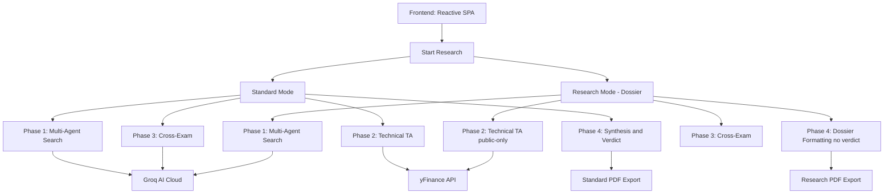

# 🪐 AlphaSwarm

> **Institutional-Grade AI Investment Research Engine**

AlphaSwarm is a high-performance, multi-agent research platform designed to provide deep, structured investment analysis. By orchestrating specialized AI agents, technical market data, and cross-examination protocols, AlphaSwarm delivers comprehensive research output with institutional rigor.


---

## ⚡ Core Engine Features

### 1. Multi-Agent Research Pipeline (Phase 1)
AlphaSwarm deploys up to **18 specialized agents** simultaneously, each focusing on a distinct facet of a company:
- **Financial Specialists**: Fundamental analysis, balance sheet health, and valuation.
- **Sentiment Analysts**: Real-time news sentiment and social buzz (Twitter/X, Reddit).
- **Specialized Risks**: Regulatory, supply chain, management quality, and ESG.
- **Strategic Specialists**: Competitive landscape, growth catalysts, and bear/bull counter-thesis specialists.

### 2. High-Fidelity Technical Analysis (Phase 2)
Direct integration with market data via `yfinance` to compute key indicators:
- **Trend**: SMA (20, 50, 200), Golden/Death Cross detection.
- **Momentum**: RSI, MACD, Stochastic.
- **Volatility**: Bollinger Bands, ATR.
- **Patterns**: Automatic candlestick pattern recognition (Doji, Hammer, Engulfing).

### 3. Agent Cross-Examination (Phase 3)
An adversarial protocol where agents review each other's findings to surface contradictions, challenge assumptions, and reduce hallucination risk.

### 4. Institutional Synthesis (Phase 4)
The **Synthesis Judge** aggregates findings, cross-exam notes, and technical data into structured output.
- **Universal Scoring**: Weighted 1-10 technical/fundamental score.
- **Dynamic Verdicts**: BULLISH, BEARISH, or NEUTRAL with specific investment actions (BUY/HOLD/SELL).
- **PDF Export**: Polished, print-ready reports via `ReportLab`.

### 5. Dual Output Modes
- **Standard Mode**: Verdict-driven memo with clear recommendations and investment framing.
- **Research (Dossier) Mode**: Raw, high-density research output with no verdict spoon-feeding, designed for analyst-driven decision-making.

---

## 🏗️ Architecture



---

## 🚀 Getting Started

### Prerequisites
- Python 3.9+
- [Groq API Key](https://console.groq.com/)

### Installation

1. **Clone the repository**
   ```bash
   git clone https://github.com/aaravg772/AlphaSwarm
   cd AlphaSwarm
   ```

2. **Set up environment variables**
   Create a `.env` file in the root directory:
   ```env
   GROQ_API_KEY=your_api_key_here
   ```

3. **Install dependencies**
   ```bash
   pip install -r requirements.txt
   ```

4. **Launch the engine**
   ```bash
   uvicorn backend.main:app --port 8000
   ```
   Access the UI at `http://localhost:8000`

---

## 🛡️ Security & Privacy
- **Local Session Storage**: Research sessions are stored locally in the `research/` directory.
- **API Key Hygiene**: Keys are loaded from environment variables and never hardcoded.
- **Hallucination Guardrails**: Verification logic flags unsourced or high-risk claims.

---

## 🎯 Design Philosophy
AlphaSwarm is built for practical investment research and prioritizes:
- **Depth over Speed**: Comprehensive multi-agent runs provide broad context.
- **Structural Integrity**: A consistent 4-phase pipeline keeps output reliable.
- **Research Clarity**: Clean UI and export formats optimized for real analysis workflows.

---

## 📄 License
This project is licensed under the MIT License - see the [LICENSE](LICENSE) file for details.
